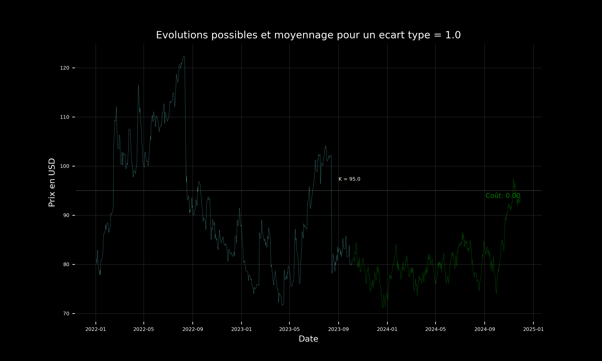

# Black-Scholes Model Simulation

This project is a Python implementation of the **Black-Scholes option pricing model**.  
It was developed as a short project, but it sparked my curiosity and I plan to extend it in the future.

---

## Context

The Black-Scholes model is a cornerstone of modern financial mathematics.  
It relies on several key assumptions:

- The underlying asset follows a **stochastic process** modeled as a **Geometric Brownian Motion (GBM)**.  
- The **volatility** of the asset is assumed to be **constant**.  
- Volatility is estimated from the asset’s **historical price data**.  
- Markets are frictionless (no arbitrage, continuous trading, constant risk-free rate).

In this project, I focused on reproducing the mathematical structure of the model and simulating asset paths accordingly.

---

## Features

- Simulation of the **Geometric Brownian Motion** underlying asset price paths.  
- Calculation of volatility from **historical asset prices**.  
- Visualization of simulated trajectories and option pricing behavior.  
- Basic animations of simulated paths (exported as `.gif`).  

---

## Example Outputs

### Simulated GBM Paths
*(to be inserted)*  


---

## How to Run

1. Clone this repository:  
   ```bash
   git clone https://github.com/your-username/Black_Scholes_project.git
   cd Black_Scholes_project
